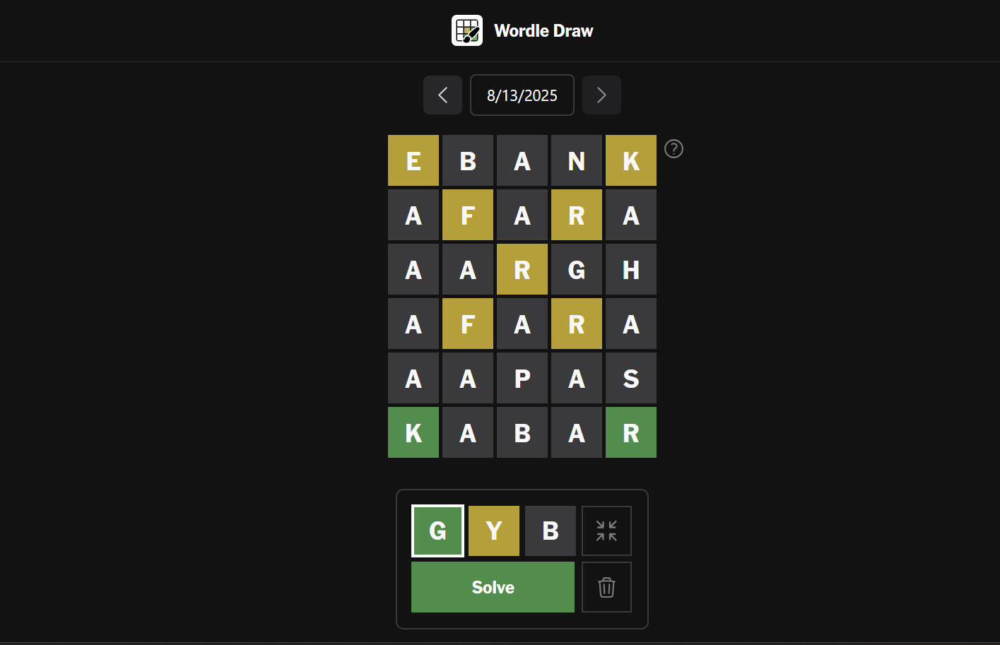

# Wordle Draw

A reverse Wordle game where you draw hint colors instead of typing words. and you get words which will give you the pattern you drew.

#### Try it at [wordle.arnv.dev](https://wordle.arnv.dev)

## Hotkeys

<!-- 
  const hotkeys = new Map<string[], string>([
    [["Enter"], "Solve Board"],
    [["Space"], "Color the Cell"],
    [["h"], "Show This Page"],
    [["x"], "Clear Board"],
    [["c"], "Collapse/Expand Board"],
    [["g"], "Choose Green Color (correct)"],
    [["y"], "Choose Yellow Color (present)"],
    [["b"], "Choose Gray Color (absent)"],
    [["w", "↑"], "Move Up"],
    [["s", "↓"], "Move Down"],
    [["a", "←"], "Move Left"],
    [["d", "→"], "Move Right"],
    [["Home"], "Focus First Cell"],
    [["End"], "Focus Last Cell"],
  ]);
 -->

- `Enter`: Solve Board
- `Space`: Color the Cell
- `h`: Show This Page
- `x`: Clear Board
- `c`: Collapse/Expand Board
- `g`: Choose Green Color (correct)
- `y`: Choose Yellow Color (present)
- `b`: Choose Gray Color (absent)
- `w`/`↑`: Move Up
- `s`/`↓`: Move Down
- `a`/`←`: Move Left
- `d`/`→`: Move Right
- `Home`: Focus First Cell
- `End`: Focus Last Cell

## Author
[Arnav Kumar](https://github.com/arnav-kr)